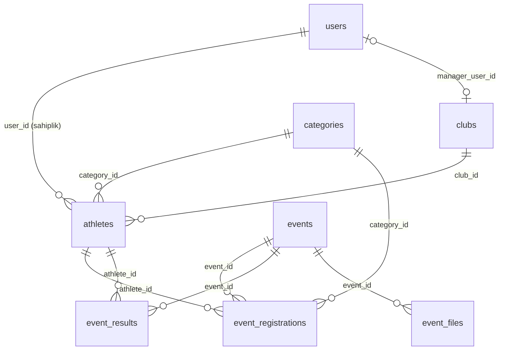

# orduoryantiring.com.tr — Genel Analiz

Kaynak: proje deposu (`Tof React-Php`) — React (Vite) frontend + özel PHP MVC backend. `CanliSonuclar.jsx` içinde `https://orduoryantiring.com.tr/api/results.php` adresinin hardcode geçmesi, bu kod tabanının canlı sitenin kendisi olduğunu doğruluyor.

Ordu ilindeki oryantiring (orienteering) sporu için hem tanıtım/duyuru sitesi hem de yarışma kayıt + sonuç yönetim sistemi.

---

## 1) Veritabanı Şeması

Veritabanı: MySQL (`orienteering`). Not: `backend/src/models/*.php` dosyaları boş — ORM/model katmanı yok, tüm sorgular controller'larda ham SQL (PDO, prepared statements) olarak yazılmış.

### Tablolar ve kolonlar

**users**
- id, email, password_hash, full_name, is_referee, is_club_manager, updated_at
- Roller boolean flag ile tutuluyor (ayrı roller tablosu yok)

**clubs**
- id, name, code, manager_user_id → users.id
- Her kulübün "yöneticisi" bir user'dır (1 user en fazla 1 kulüp yönetir)

**categories**
- id, code, name, gender, min_birth_year, max_birth_year
- Yaş/cinsiyet bazlı yarışma kategorileri (örn. W21, M35 gibi oryantiring standardı)

**athletes**
- id, user_id → users.id, club_id → clubs.id, category_id → categories.id
- first_name, last_name, gender, birth_year, national_id (TC), license_no, si_chip_no
- created_at, updated_at
- `si_chip_no`: SportIdent çip numarası (oryantiring zaman tutma donanımı)

**events**
- id, name, description, type, start_date, end_date, location
- is_registration_open, registration_start_at, registration_end_at
- bulletin_path / oncikis_path / kesincikis_path (legacy, artık event_files kullanılıyor)
- slug, folder_key (LPAD(id,5,'0') — dosya klasörü anahtarı), season_start_year, season_end_year (sezon Eylül'de başlıyor)
- created_at, updated_at

**event_files**
- id, event_id → events.id, kind (bulletin | oncikis | kesincikis)
- storage_key, original_name, mime_type, size_bytes
- version, is_current, deleted_at, created_at, updated_at
- Versiyonlanabilir dosya sistemi: her yeni PDF yükleme eskisini "current" olmaktan çıkarıp yeni versiyon ekliyor (silme = soft delete)

**event_registrations**
- id, event_id → events.id, athlete_id → athletes.id, category_id → categories.id
- registered_at, status (pending | approved | cancelled)

**event_results**
- id, event_id → events.id, athlete_id → athletes.id, category_id → categories.id
- time_ms, status (OK | DNF | DSQ | DNS)
- created_at, updated_at — UNIQUE(event_id, athlete_id) üzerinden upsert

### İlişki diyagramı (mermaid ER)

### Yetki/mülkiyet mantığı
- Bir kullanıcı bir kulübü yönetiyorsa (`clubs.manager_user_id`), o kulübün sporcularını (`athletes.club_id`) ekleyip yönetebiliyor.
- Sporcu kaydı aynı zamanda `athletes.user_id` ile de sahiplenilmiş — yarışma kaydı (`event_registrations`) oluştururken sistem sporcunun `user_id`'sinin login olan kullanıcıyla eşleştiğini kontrol ediyor.
- Etkinlik oluşturma/düzenleme, dosya yükleme, CSV export, kayıt durumu değiştirme → sadece `is_club_manager` veya `is_referee` rolü olanlara açık.

---

## 2) Ekran Envanteri ve İşlevler

### A. Herkese Açık (Public) Ekranlar

| Ekran | Yol | Durum | İşlev |
|---|---|---|---|
| Giriş | `/login` | Aktif | E-posta/şifre ile giriş, `/api/login`'e POST, başarılıysa `/app`'e yönlendirir |
| Duyurular | `/duyurular` | **Taslak** | Sadece "Duyurular çalışıyor" yazıyor, içerik yok |
| Haberler | `/haberler` | **Taslak** | "Duyurular ile aynı formatta olacak" — henüz boş |
| Faaliyet Takvimi | `/faaliyet-takvimi` | Aktif | Statik bir PDF'i (`/docs/faaliyet-takvimi.pdf`) iframe içinde gösterir, indirme/yeni sekmede açma linki var |
| İletişim | `/iletisim` | Aktif | Ad/telefon/e-posta/konu/mesaj formu, TR telefon formatı doğrulama, honeypot bot koruması, `/api/contact`'a POST → PHPMailer ile SMTP mail gönderimi + rate limit (aynı IP'den 30sn); sağda iletişim bilgileri ve Google Maps embed |
| Kurumsal → Federasyonumuz / Hakemlerimiz / Antrenörlerimiz / Kulüplerimiz | `/kurumsal/*` | **Taslak** | Dört sayfa da "İçerik daha sonra eklenecek" placeholder |
| Yarışma Bülteni | `/yarisma-basvurulari/yarisma-bulteni` | Aktif | Tüm etkinlikleri kart listesi halinde gösterir (arama kutusu var); her kartta: kayıt durumu rozeti (Açık/Kapalı/Başlamadı/Bitti), bülten PDF linki, "Yarışmacılar" linki, ön çıkış/kesin çıkış listesi PDF linkleri, uygunsa "Kayıt" butonu. Aktif/kayıt-açık etkinlikler üstte sıralanıyor |
| Yarışmacılar | `/yarisma-basvurulari/yarismacilar?event=ID` | Aktif | Seçili etkinliğe kayıtlı sporcuları listeler; kulüp/kategori dropdown filtresi + serbest metin arama |
| Yarışma Kayıt | `/yarisma-basvurulari/kayit?event=ID` | Aktif (giriş gerektirir — backend `RequireAuth`) | İki panelli ekran: solda kullanıcının kendi sporcuları (arama ile filtrelenebilir, "Ekle" butonu), sağda o etkinlikteki kendi kayıtları ("Çıkar" butonu). Kayıt penceresi (açık/kapalı/başlamadı/bitti) kontrolüne göre butonlar devre dışı kalıyor |
| Sonuçlar | `/sonuclar` | Aktif | Etkinlikleri yıla göre gruplayıp listeler; her etkinlik için `/api/results.php` üzerinden Toplu/Genel/Ara Zaman sonuç dosyalarının var olup olmadığını "probe" eder ve varsa buton gösterir (yeni sekmede açılır) |
| Ara Sonuçlar | `/sonuclar/ara` | Aktif | `ResultsDynamicTable` bileşeni, `source=intermediate` ile ara zaman sonuçlarını tablo halinde gösterir |
| Canlı Sonuçlar | `/sonuclar/canli` | Aktif | OE2010 (oryantiring zaman tutma yazılımı) çıktısı olan HTML'i `https://orduoryantiring.com.tr/api/results.php?source=live` adresinden çekip DOM parse ederek kategori bazlı canlı sıralama gösterir; 60 saniyede bir otomatik yeniler, manuel yenile butonu, kategori/kulüp filtresi, "sadece bitirenler" filtresi, mobil kart/masaüstü tablo görünümü |
| Etkinlikler (kamuya açık kopya) | `/events` | Aktif ama garip | `Events.jsx` bileşeni panel dışı bir route'ta da bağlanmış; backend zaten yetkisiz kullanıcıların create/update/delete yapmasını engelliyor, ama arayüzde "Düzenle" gibi butonlar login olmayan/rolü olmayan kullanıcıya görünmeyecek şekilde `canManage` kontrolüyle gizleniyor |
| 404 | `*` | Aktif | Bulunamadı sayfası |

### B. Panel (Giriş Gerektiren, `/app/*`) Ekranlar

| Ekran | Yol | İşlev |
|---|---|---|
| Dashboard | `/app` | "Yarışmalar" ve "Sporcular" bölümlerine hızlı erişim kartları |
| Yarışmalar | `/app/events` | Etkinlik listesi + arama. Yetkili kullanıcılar (`is_club_manager`/`is_referee`) için: yeni etkinlik oluşturma (modal: ad, açıklama, tür, tarih aralığı, yer, kayıt açık/kapalı, kayıt başlangıç/bitiş), düzenleme, silme (onay istiyor), kayıt açık/kapalı toggle butonu, kayıt bitiş tarihini satır içi (inline) düzenleme, bülten/ön çıkış/kesin çıkış PDF yükleme ve silme, kayıtlı sporcuların CSV'sini indirme |
| Sporcular | `/app/athletes` | Kullanıcının yönettiği kulübe ait sporcuları listeleme, ekleme, düzenleme, silme. Form: ad, soyad, cinsiyet, doğum yılı, lisans no, SI çip no, TC kimlik no (zorunlu), kategori (zorunlu, dropdown) |
| Şifre Değiştir | `/app/change-password` | Mevcut şifre doğrulama + yeni şifre + tekrar; min 8 karakter, eskiyle aynı olamaz kontrolü |

---

## 3) Genel Gözlemler

- **İki katmanlı erişim modeli**: herkese açık bilgi/kayıt tarafı ile kulüp yöneticisi/hakem paneli aynı React uygulaması içinde, route bazlı ayrılmış (`ProtectedRoute` + backend `RequireAuth`/`Auth::requireRole`).
- **Zaman tutma entegrasyonu**: Sonuç ekranları OE2010 (oryantiring yarışlarında yaygın kullanılan zaman tutma yazılımı) HTML export dosyalarını okuyor — bu, bir üçüncü parti masaüstü yazılımından web sitesine sonuç aktarımı yapıldığını gösteriyor.
- **Dosya yönetimi**: PDF yüklemeler (bülten, ön çıkış, kesin çıkış) MIME + magic-byte kontrolü ile doğrulanıyor, versiyonlanıyor, klasör yapısı `uploads/events/{folder_key}/{tür}/...` şeklinde.
- **Eksik/yarım içerik**: Duyurular, Haberler ve dört Kurumsal sayfa (Federasyonumuz, Hakemlerimiz, Antrenörlerimiz, Kulüplerimiz) şu an placeholder — canlıda "İçerik daha sonra eklenecek" görünüyor olabilir.
- **Kod tabanında temizlenmemiş eski dosyalar**: `EventController_old.php`, `EventController.with_uploads_delete.php`, `Events_old.jsx`, `Events_last.jsx`, `EventModal_old.jsx`, `Sonuclar_old.jsx`, `YarismaBulteni_old.jsx` gibi çok sayıda "_old" versiyon repo içinde duruyor — production build'e dahil olmasalar da proje bakımı açısından temizlenmeye aday.
- **Login sayfasında** varsayılan state değerleri `admin@test.com` / `1234` olarak kodda duruyor (input `value` bağlı olmadığı için ekranda görünmüyor ama kaynak kodda dev/test artığı olarak kalmış).
